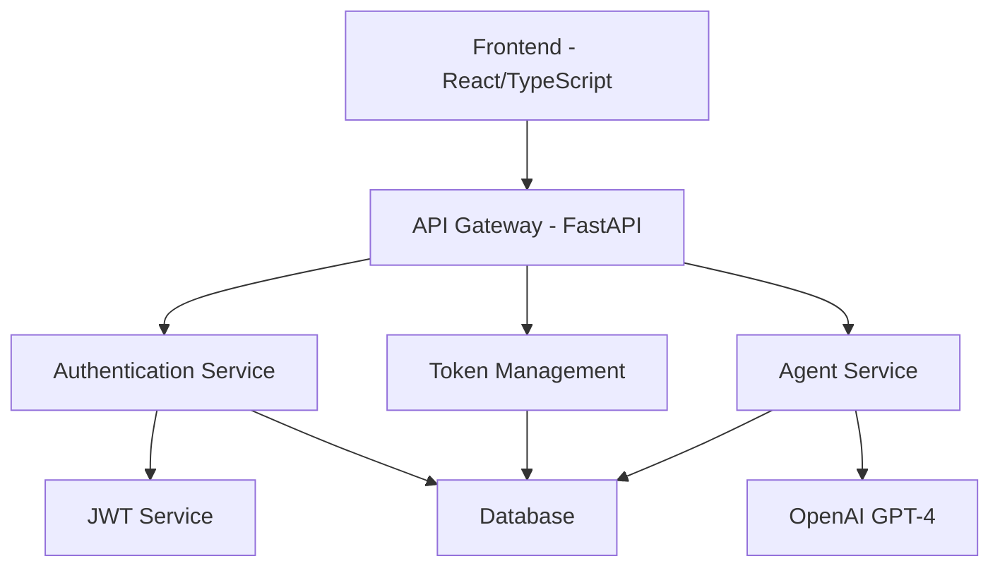

# AI Agent Hub

A modern, full-stack AI agent marketplace platform that provides users with access to specialized AI agents for various tasks such as code review, resume review, interview preparation, and writing assistance.

## Project Overview

### Goal
Create a scalable, secure marketplace for AI-powered agents that can assist users with various professional tasks. The platform focuses on providing high-quality, specialized AI services while maintaining a user-friendly interface and robust token-based economy.

### Key Features
1. Multiple specialized AI agents
2. Token-based payment system
3. Secure user authentication
4. Real-time agent interaction
5. Usage tracking and history

## Technical Architecture

### System Components

### Technology Stack
- Frontend: React with TypeScript
- Backend: FastAPI (Python)
- Database: PostgreSQL
- Authentication: JWT
- AI: OpenAI GPT-4
- Testing: Selenium, Pytest

## Security Features
- JWT-based authentication
- Password hashing
- Rate limiting
- Input validation and sanitization

For detailed usage instructions, please see our [Usage Guide](docs/usage_guide.md).

## Screenshots

### Authentication

*Secure login interface with JWT authentication*

### Dashboard

*User dashboard showing available agents and token balance*

### Marketplace Overview

*AI Agent Marketplace displaying available agents*

For complete technical details, API specifications, and database schema, please refer to our [Technical Documentation](docs/technical_documentation.md).

## License
MIT License

## Contributing
We welcome contributions! Please see our contributing guidelines for more information.
