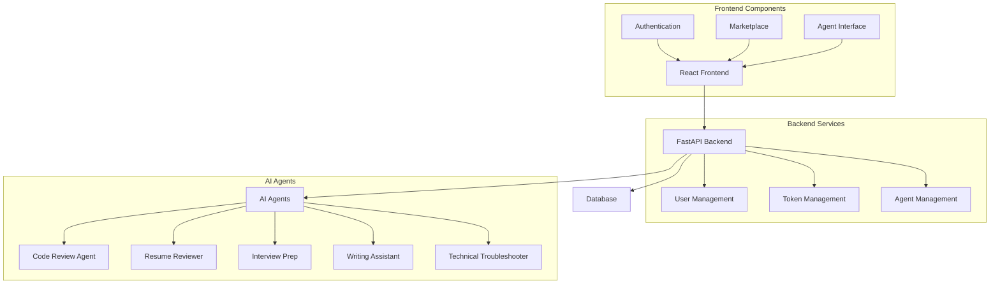

# AI Agent Hub: A Marketplace for Intelligent Agents

## Goal
The AI Agent Hub is a sophisticated marketplace platform that provides users with access to various specialized AI agents. Each agent is designed to perform specific tasks, from code review to resume analysis, making AI capabilities accessible through a user-friendly interface.

## Technical Architecture

### Overview
The platform is built using a modern tech stack:
- Frontend: React with TypeScript and Material-UI
- Backend: FastAPI (Python)
- Database: SQLAlchemy with SQLite
- Authentication: JWT-based token authentication
- API: RESTful endpoints with OpenAPI documentation

### Architecture Diagram


### Key Components

#### 1. Frontend Architecture
- **React with TypeScript**: Provides type-safe component development
- **Material-UI**: Implements a consistent, modern UI design
- **Context-based State Management**: Handles authentication and user state
- **React Router**: Manages application routing and navigation

#### 2. Backend Architecture
- **FastAPI Framework**: Offers high-performance API endpoints
- **SQLAlchemy ORM**: Provides database abstraction and management
- **JWT Authentication**: Ensures secure user sessions
- **Middleware**: Handles CORS and request processing

#### 3. AI Agents
Each agent is implemented as a separate module with specialized capabilities:
- **Code Review Agent**: Analyzes code quality and suggests improvements
- **Resume Reviewer**: Evaluates resumes and provides feedback
- **Interview Prep**: Helps users prepare for technical interviews
- **Writing Assistant**: Enhances writing quality and style
- **Technical Troubleshooter**: Assists with technical problem-solving

## Features

### 1. User Management
- Secure registration and authentication
- JWT-based session management
- User profile and token balance tracking

### 2. Marketplace Interface

*The marketplace displays available AI agents*

### 3. Agent Integration
Each agent provides:
- Specialized input interfaces
- Real-time processing
- Detailed response formatting
- Usage tracking and history

### 4. Token System
- Pay-per-use model
- Token purchase and management
- Usage tracking and billing

### 5. Security Features
- Encrypted communication
- Secure token storage
- Rate limiting and abuse prevention
- Input validation and sanitization

## User Interface

### Authentication

*Secure login interface with JWT authentication*

### Dashboard

*User dashboard showing available agents and token balance*

### Marketplace Overview

*AI Agent Marketplace displaying available agents*

### User Profile

*User profile page showing account details and token balance*

### Usage History

*Detailed history of agent invocations and token usage*

## Agent Interfaces

### Code Review Agent

*Code Review Agent interface*


*Code submission interface with language selection*

### Resume Reviewer Agent

*Resume Review Agent interface*


*Resume submission interface with industry context*

### Interview Prep Agent

*Interview Preparation Agent interface*


*Interview question submission interface*

### Writing Assistant Agent

*Writing Assistant Agent interface*


*Text submission interface for writing improvement*

## Agent Implementation Details

### Base Architecture
All agents in the AI Agent Hub inherit from a common `BaseAgent` class, which provides:
- Token pricing management
- Usage tracking
- Error handling
- Response formatting

### Agent Specifications

#### 1. Code Review Agent
```python
class CodeReviewAgent(BaseAgent):
    # Pricing: $0.0002 per token
    # Model: GPT-4 Turbo Preview
    
    Features:
    - Language-specific code analysis
    - Contextual review based on project requirements
    - Focus areas:
      * Code correctness
      * Performance efficiency
      * Coding style
      * Improvement suggestions
```

#### 2. Resume Reviewer Agent
```python
class ResumeReviewerAgent(BaseAgent):
    # Pricing: $0.0002 per token
    # Model: GPT-4 Turbo Preview
    
    Features:
    - Industry-specific resume analysis
    - Position-targeted feedback
    - Focus areas:
      * Content & Impact
      * Structure & Organization
      * Language & Clarity
      * Improvement recommendations
```

### Integration Pattern
Each agent follows a consistent integration pattern:
```python
async def process_request(self, input_data: str, context: str = None) -> Dict[str, Any]:
    """
    1. Input Validation
    2. Context Integration
    3. AI Model Invocation
    4. Response Processing
    5. Token Usage Tracking
    6. Error Handling
    """
```

### AI Model Integration
- Primary Model: GPT-4 Turbo Preview
- Integration: AsyncOpenAI client
- Configuration: Environment-based API key management
- Response Format: Structured JSON with:
  * Output text
  * Token usage
  * Processing metadata

### Error Handling
```python
try:
    # Agent-specific processing
except Exception as e:
    raise Exception(f"Error in {agent_name}: {str(e)}")
```

### Token Management
- Per-token pricing model
- Usage tracking per request
- Token balance verification
- Automatic usage updates

## Contributing to AI Agent Hub

### Development Environment Setup

1. **Fork and Clone**
```bash
git clone https://github.com/your-username/ai-agent-marketplace.git
cd ai-agent-marketplace
```

2. **Backend Setup**
```bash
# Create virtual environment
python -m venv venv
source venv/bin/activate  # On Windows: venv\Scripts\activate

# Install dependencies
pip install -r requirements.txt

# Set up environment variables
cp .env.example .env
# Edit .env with your configuration:
# - OPENAI_API_KEY
# - JWT_SECRET
# - DATABASE_URL
```

3. **Frontend Setup**
```bash
cd frontend

# Install dependencies
npm install

# Set up environment variables
cp .env.example .env.local
# Edit .env.local with:
# - REACT_APP_API_URL=http://localhost:8000
```

4. **Database Setup**
```bash
# Initialize database
python src/database/init_db.py

# Run migrations
alembic upgrade head
```

### Development Workflow

1. **Create Feature Branch**
```bash
git checkout -b feature/your-feature-name
```

2. **Run Tests**
```bash
# Backend tests
pytest

# Frontend tests
cd frontend
npm test
```

3. **Code Style**
- Backend: Follow PEP 8
- Frontend: Use ESLint configuration
- Run linters before committing:
```bash
# Backend
flake8 src/
black src/

# Frontend
cd frontend
npm run lint
```

### Modifying Existing Agents

When modifying an existing agent, consider:

1. **Token Usage**
```python
class YourAgent(BaseAgent):
    def __init__(self):
        super().__init__(
            name="Your Agent",
            description="Description",
            price_per_token=0.0002  # Must be justified
        )
```

2. **Error Handling**
```python
try:
    # Agent-specific processing
    response = await self.client.chat.completions.create(
        model="gpt-4-turbo-preview",
        messages=[...]
    )
except OpenAIError as e:
    # Handle OpenAI-specific errors
    raise AgentError(f"OpenAI error: {str(e)}")
except Exception as e:
    # Handle general errors
    raise AgentError(f"Unexpected error: {str(e)}")
```

3. **Input Validation**
```python
async def process_request(self, input_data: str, context: str = None) -> Dict[str, Any]:
    # Validate input
    if not input_data or len(input_data.strip()) == 0:
        raise ValidationError("Input data cannot be empty")
    
    # Validate context if provided
    if context and len(context) > 1000:
        raise ValidationError("Context too long, maximum 1000 characters")
```

4. **Response Format**
```python
return {
    "output_text": str,      # Main response
    "tokens_used": int,      # Token usage
    "metadata": Dict,        # Optional metadata
    "suggestions": List[str] # Optional suggestions
}
```

### Adding New Agents

When creating a new agent:

1. **File Structure**
```
src/
└── agents/
    ├── __init__.py
    ├── base_agent.py
    └── your_new_agent/
        ├── __init__.py
        ├── agent.py
        ├── prompts.py
        └── tests/
            ├── __init__.py
            ├── test_agent.py
            └── test_data/
```

2. **Agent Implementation Template**
```python
from typing import Dict, Any
from ..base_agent import BaseAgent
from .prompts import SYSTEM_PROMPT, USER_PROMPT_TEMPLATE

class NewAgent(BaseAgent):
    def __init__(self):
        super().__init__(
            name="New Agent Name",
            description="Detailed description",
            price_per_token=0.0002
        )
        self._initialize_prompts()
    
    def _initialize_prompts(self):
        """Initialize agent-specific prompts"""
        self.system_prompt = SYSTEM_PROMPT
        self.user_prompt_template = USER_PROMPT_TEMPLATE
    
    async def process_request(self, input_data: str, context: str = None) -> Dict[str, Any]:
        """
        Process user request
        
        Args:
            input_data: Primary input for processing
            context: Optional context to guide processing
            
        Returns:
            Dict containing:
            - output_text: Processed result
            - tokens_used: Token usage count
            - metadata: Additional processing info
        """
        # Implementation
```

3. **Required Tests**
```python
import pytest
from your_new_agent.agent import NewAgent

@pytest.fixture
def agent():
    return NewAgent()

def test_agent_initialization(agent):
    assert agent.name == "New Agent Name"
    assert agent.price_per_token == 0.0002

@pytest.mark.asyncio
async def test_process_request(agent):
    result = await agent.process_request("test input")
    assert "output_text" in result
    assert "tokens_used" in result

@pytest.mark.asyncio
async def test_input_validation(agent):
    with pytest.raises(ValidationError):
        await agent.process_request("")
```

4. **Frontend Integration**
```typescript
// frontend/src/components/agents/NewAgent.tsx
import React from 'react';
import { AgentProps } from '../types';

export const NewAgent: React.FC<AgentProps> = ({
  onSubmit,
  loading,
}) => {
  // Implementation
};
```

5. **Documentation Requirements**
- Agent purpose and capabilities
- Input/output specifications
- Token usage estimates
- Example use cases
- Error scenarios and handling

### Testing

1. **Unit Tests**
```bash
# Run specific agent tests
pytest src/agents/your_agent/tests/

# Run with coverage
pytest --cov=src/agents/your_agent
```

2. **Integration Tests**
```bash
# Run API tests
pytest tests/integration/

# Run frontend integration tests
cd frontend
npm run test:integration
```

3. **Screenshot Tests**
```bash
# Run screenshot bot
cd screenshots_bot
python agent_test_bot.py
```

### Pull Request Guidelines

1. **PR Template**
```markdown
## Description
[Description of changes]

## Type of Change
- [ ] Bug fix
- [ ] New feature
- [ ] Agent modification
- [ ] Documentation update

## Testing
- [ ] Unit tests added/updated
- [ ] Integration tests added/updated
- [ ] Screenshot tests updated
- [ ] Manual testing performed

## Token Usage Impact
[If applicable, describe impact on token usage]
```

2. **Review Checklist**
- Code follows style guidelines
- Tests are comprehensive
- Documentation is updated
- Token usage is optimized
- Error handling is robust
- Security considerations are addressed

### Deployment

1. **Staging Deployment**
```bash
# Backend
docker build -t ai-agent-hub-backend .
docker run -p 8000:8000 ai-agent-hub-backend

# Frontend
cd frontend
npm run build
docker build -t ai-agent-hub-frontend .
docker run -p 3000:80 ai-agent-hub-frontend
```

2. **Production Considerations**
- Environment variables are properly set
- Database migrations are tested
- Load testing is performed
- Security scanning is completed
- Backup procedures are verified

## Future Plans

### Short-term Improvements
1. **Enhanced Agent Capabilities**
   - Improved response quality
   - More specialized use cases
   - Better error handling

2. **User Experience**
   - Enhanced response visualization
   - Interactive tutorials
   - Improved mobile responsiveness

3. **Platform Features**
   - Batch processing capabilities
   - API key management
   - Custom agent configuration

### Long-term Goals
1. **Platform Expansion**
   - Additional AI agents
   - Custom agent development platform
   - Integration marketplace

2. **Enterprise Features**
   - Team management
   - Usage analytics
   - Custom deployment options

3. **AI Capabilities**
   - Advanced language models
   - Multi-modal processing
   - Real-time collaboration

4. **Marketplace Growth**
   - Third-party agent integration
   - Agent marketplace
   - Revenue sharing model

## Technical Specifications

### API Endpoints
```http
# User Management
POST /auth/register
    Request:
        {
            "username": string,
            "email": string,
            "password": string
        }
    Response:
        {
            "id": integer,
            "username": string,
            "email": string,
            "token_balance": float
        }

POST /auth/login
    Request:
        {
            "username": string,
            "password": string
        }
    Response:
        {
            "access_token": string,
            "token_type": string
        }

# Agent Management
GET /agents
    Response:
        [
            {
                "id": integer,
                "name": string,
                "description": string,
                "price_per_token": float
            }
        ]

POST /agents/{id}/invoke
    Request:
        {
            "input_data": string,
            "context": string (optional)
        }
    Response:
        {
            "output_text": string,
            "tokens_used": integer,
            "cost": float
        }

# Token Management
GET /users/me/balance
    Response:
        {
            "token_balance": float
        }

POST /tokens/purchase
    Request:
        {
            "amount": float
        }
    Response:
        {
            "new_balance": float,
            "transaction_id": string
        }
```

### Database Schema
```sql
Users (
    id INTEGER PRIMARY KEY,
    username TEXT UNIQUE,
    email TEXT UNIQUE,
    password_hash TEXT,
    token_balance FLOAT,
    created_at DATETIME DEFAULT CURRENT_TIMESTAMP,
    updated_at DATETIME DEFAULT CURRENT_TIMESTAMP
)

Agents (
    id INTEGER PRIMARY KEY,
    name TEXT,
    description TEXT,
    price_per_token FLOAT,
    model_version TEXT,
    status TEXT,
    created_at DATETIME DEFAULT CURRENT_TIMESTAMP,
    updated_at DATETIME DEFAULT CURRENT_TIMESTAMP
)

AgentInvocations (
    id INTEGER PRIMARY KEY,
    user_id INTEGER,
    agent_id INTEGER,
    input_data TEXT,
    output_text TEXT,
    tokens_used INTEGER,
    cost FLOAT,
    status TEXT,
    created_at DATETIME DEFAULT CURRENT_TIMESTAMP,
    FOREIGN KEY (user_id) REFERENCES Users(id),
    FOREIGN KEY (agent_id) REFERENCES Agents(id)
)

TokenTransactions (
    id INTEGER PRIMARY KEY,
    user_id INTEGER,
    amount FLOAT,
    transaction_type TEXT,
    created_at DATETIME DEFAULT CURRENT_TIMESTAMP,
    FOREIGN KEY (user_id) REFERENCES Users(id)
)

AgentFeedback (
    id INTEGER PRIMARY KEY,
    user_id INTEGER,
    agent_id INTEGER,
    invocation_id INTEGER,
    rating INTEGER,
    feedback_text TEXT,
    created_at DATETIME DEFAULT CURRENT_TIMESTAMP,
    FOREIGN KEY (user_id) REFERENCES Users(id),
    FOREIGN KEY (agent_id) REFERENCES Agents(id),
    FOREIGN KEY (invocation_id) REFERENCES AgentInvocations(id)
)
```

## Conclusion
The AI Agent Hub represents a sophisticated platform for accessing specialized AI capabilities through a user-friendly interface. Its modular architecture, robust security features, and extensible design make it a powerful solution for both individual users and enterprises seeking AI-powered assistance.
